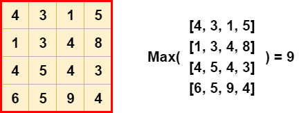
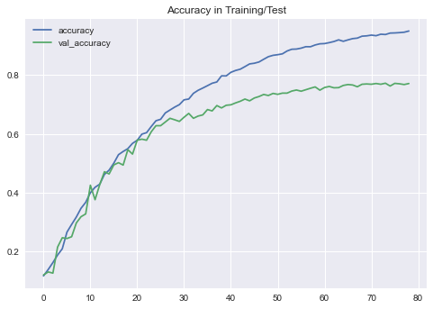
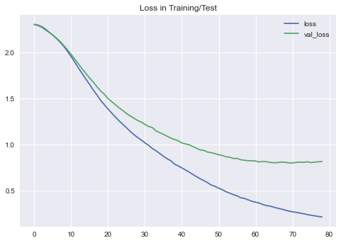

## Installation

Navigate to the root folder

    cd nlp-exercise

Install the dependencies:

For this project I used:

- Python 3.8.8
- TensorFlow
- Flask
- Matplotlib
- NLTK
- Praw (Reddit API)
- Pandas

Specific versions are specified in the `requirements.txt` file.

```
// Install Globally

pip install -r requirements.txt

// Or inside a virtual environment

python -m venv .venv
.venv\Scripts\activate  // Windows
source .venv/bin/activate  // MacOS/Linux
pip install --upgrade pip
pip install -r requirements.txt
```

## Usage

To be able to see the classifications we will need:

- API credentials
  - These are provided for you in the `config.ini` file
- Data
  - Included in `data/data.json`
  - Can be collected using the function `get_data`
  - Contains 1000 posts per subreddit from 10 different subreddits
- Model
  - Included in `models/saved_models/model.h5`
  - Easily loaded with TensorFlow
  - Can be re-trained with the `exercise.ipynb` notebook

I've included data in the `data` folder in `json` format

In the notebook `exercise.ipynb` you will find these processes:

- Getting the data
- Inspecting the data
- Preprocessing
- Modeling
- Evaluation
- Making predictions

## Results

I've included a `results` directory, you will find the model's prediction and relevant information over there.

I also used TensorBoard as a callback in the training phase, you can open up TensorBoard like this:

```
tensorboard --logdir=logs // Make sure you're in the root directory'

And go to:

http://localhost:6006/
```

After the model is trained you will be able to make predictions, you can use:

- The notebook, it contains a `predict` function towards the end of the file, you can easily insert new posts and see the predictions.
- Use the UI version:
  - Run `python app.py`
  - Go to http://localhost:5000
  - Grab a post from one of the subreddits the model was trained on:
    - Title + Body
  - Press "Go!" to get a prediction

## Description

### Input data

I could've taken a few routes here:

1. Scrape the data directly from Reddit.
2. Use the Reddit API package for Python called `PRAW`.
3. Download a dataset online from someone who tackled a similar task on Reddit.

I decided to use the `PRAW` package so I will have more control over the data that is being fetched, also online datasets are too big (3-4GBs and more) so I'm keeping it small here so it can be sent and used on another computer.

I used the `praw` package to request data for various subreddits.

You can create a client object (praw.Reddit), with this object you can make requests for top posts/hot posts inside a subreddit, credentials are needed to use the API, you can get them for free on `https://www.reddit.com/prefs/apps`.

For the text inputs we have for each post:

- Title
- Body

Many posts contain tiny or no body and/or small title, so...

I had a bit of an issue on whether I should use the title or the body, eventually I decided to use both by concatenating the `title` and `body` of each post, the model will be trained with both as one string.

## Preprocessing

Pretty straightforward, I had to clean up the data before the neural network could make meaningful representations of it.

I went through these steps:

- Seperate the texts and labels
- Remove special characters
- Convert the text to lowercase
- Remove stop words (I, you, we, they, etc)
- Split each sentence by space to get a list of words

Afterwards, I've split the data into training and test sets with a ratio of 80/20.

After this I had to build a corpus and tokenize the data.

Building a corpus - a corpus is a map between a word and its integer representation, for example:

```
'correlated' -> 24649
'python' -> 5
```

I've used the Tokenizer() object provided by TensorFlow to create this mapping for all the words in the training (!) data.

I've also specified my `vocab_size` which determines how big the corpus can be and my `max_length` which determines how long the texts will be, the neural network expects a fixed-size input, if there's a sentence that is smaller than the `max_length` it will be padded.

Next, we use this tokenizer to transform our texts from their string representation to integers:

```
'I love my dog' -> [1, 5, 4, 3]
```

Now we have a training and test set that can be used to train a model.

## Modeling

I considered using deep learning models or traditional machine learning models such as Random Forests or SVMs, I eventually decided to use deep learning because I am more comfortable with that and the state of the art in recent years is coming from that area, especially in tasks like this (natural language processing), also this means we can use TensorFlow for the modeling, which makes things much smoother thanks to the nice Keras library it has.

I used a deep learning model which is made up of the following layers:

1. Embedding layer - this layer transforms our word corpus to something the next layers can work better with, it's basically a mapping that creates a representation of each word in some higher dimensional space, the `embedding_dim` parameter decides the size of each vector in that new space.
2. Global max pooling layer - this layer reduces the output of the preceding layer to 1 number, in this way:

</img>

3. Dense layer with 64 units and ReLU activation function

This layer tries to learn the patterns in the text.

4. Dropout

I added a dropout layer of 20% to reduce overfitting

5. Output layer

Dense layer with 10 neurons, one per class we are trying to classify, I used Softmax activation to convert the log probabilities to actual probabilities.

For the training I used the Adam optimizer with a learning rate of `3e-4`, and for the loss I used Sparse Categorical Crossentropy, which gives the distance between a distribution and a target distribution, this fits for a classification task.

The training looked like this:

</img>
</img>

## Evaluation

We're getting 77% accuracy on the test set, it does seem like the model is overfitting the training set a bit, I'm pretty sure that using more data would improve this dramatically and maybe more regularization.

More metrics:

- Accuracy - 0.771788
- Precision - 0.783155
- Recall - 0.772556
- F1 - 0.773631

Improvements:

- Use more data
  - There's a dataset containing almost 4GB of Reddit data, our dataset was only 4KB of JSON data, because this needs to be submitted as a `.zip` file and therefore must be smaller, this will definitely be the best improvement to the model
- Do some hyperparameter tuning
  - Units
  - Vocabulary sizes
  - Learning rate schedule
  - Embedding dimensions
  - ...
- Use a more sophisticated model architecture
  - LSTM layer/s to pick up sequential patterns
- Use a pre-trained embedding layer from TensorFlow Hub (for example: BERT)
